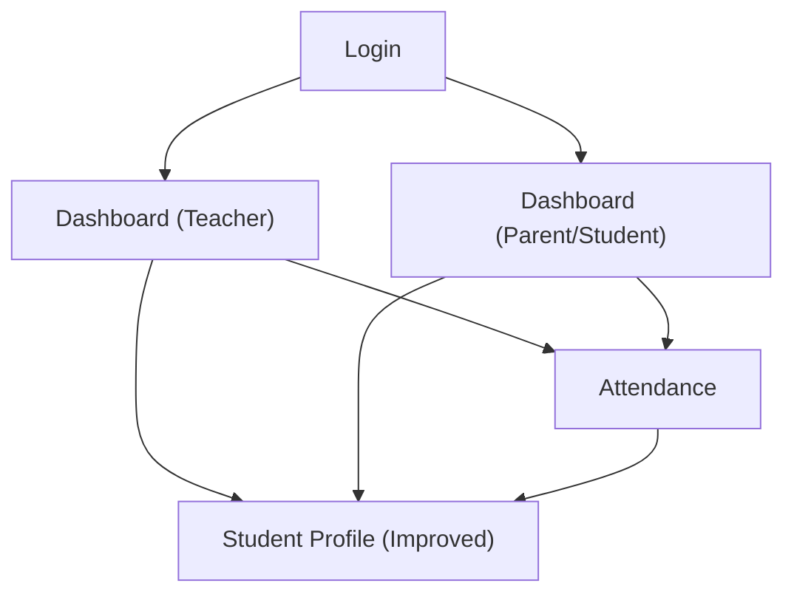

## 1. Product Overview
A role-based school portal that lets teachers manage classes and attendance, while parents/students track progress and daily presence.
It focuses on fast, “premium” dashboard UX and an improved student profile that is easy to understand and share.

## 2. Core Features

### 2.1 User Roles
| Role | Registration Method | Core Permissions |
|------|---------------------|------------------|
| Teacher | School-provisioned account (email/phone) | View assigned classes, take attendance, view student profiles |
| Parent | School-provisioned account linked to student(s) | View child dashboard, attendance history, student profile |
| Student | School-provisioned account | View own dashboard, attendance history, own profile |

### 2.2 Feature Module
1. **Login**: secure sign-in, role detection, session persistence.
2. **Dashboard (Teacher)**: overview KPIs, today’s classes, quick actions.
3. **Dashboard (Parent/Student)**: attendance summary, recent updates, quick links.
4. **Attendance**: take attendance per class/date, view attendance history.
5. **Student Profile (Improved)**: unified student record with key sections and summaries.

### 2.3 Page Details
| Page Name | Module Name | Feature description |
|-----------|-------------|---------------------|
| Login | Authentication | Sign in with email/phone + password; show errors; keep session until logout |
| Login | Premium UX baseline | Show clean form layout, inline validation, loading state, and accessible focus order |
| Dashboard (Teacher) | KPI overview | Show cards for today’s classes, present/absent counts (today), and attendance completion status |
| Dashboard (Teacher) | Today’s schedule | List assigned classes for today with “Take attendance” CTA |
| Dashboard (Teacher) | Student lookup | Search student by name/ID and open student profile |
| Dashboard (Teacher) | Premium UX baseline | Provide skeleton loading, empty states, and consistent card/grid layout |
| Dashboard (Parent/Student) | Attendance snapshot | Show attendance rate trend (e.g., month-to-date) and today’s status if available |
| Dashboard (Parent/Student) | Quick links | Link to Attendance history and Student profile |
| Dashboard (Parent/Student) | Premium UX baseline | Provide clear hierarchy, readable summaries, and friendly microcopy for missing data |
| Attendance | Class/date selection | Select class and date (default today); show roster count and last-saved time |
| Attendance | Marking | Mark Present/Absent/Late (if enabled) for each student; bulk actions; save draft and submit |
| Attendance | History | View attendance history by date range and class; open a day to review |
| Attendance | Premium UX baseline | Use sticky table header, fast filters/search within roster, and clear save/submit feedback |
| Student Profile (Improved) | Profile header | Show student name, ID, class, photo/avatar, and key status chips (e.g., active) |
| Student Profile (Improved) | Core details sections | Show essential sections (personal info, guardian/contacts (for parent/teacher), and school info) |
| Student Profile (Improved) | Attendance summary | Show attendance rate and recent absences; deep link to Attendance history |
| Student Profile (Improved) | Premium UX baseline | Provide section anchors, print/share-friendly layout, and graceful empty states for unknown fields |

## 3. Core Process
**Teacher flow**: Sign in → land on Teacher Dashboard → open “Take attendance” for a class → mark students → save/submit → open a student profile to review details and attendance summary.

**Parent/Student flow**: Sign in → land on Parent/Student Dashboard → review attendance snapshot → open Attendance history for details → open Student Profile to review full record.

