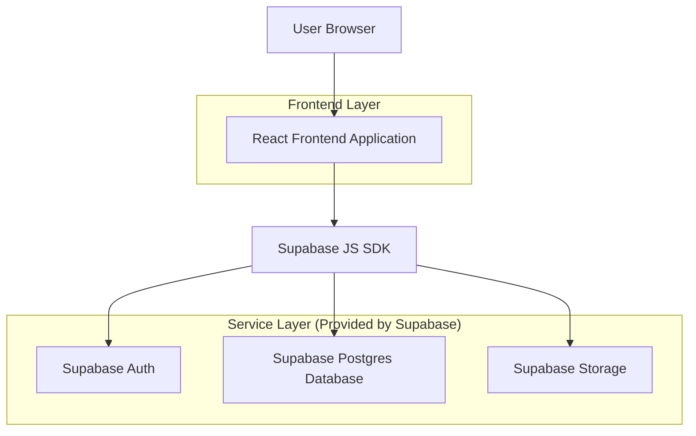

## 1.Architecture design


## 2.Technology Description
- Frontend: React@18 + TypeScript + vite + tailwindcss@3 + react-router
- Backend: Supabase (Auth + Postgres + Storage)

## 3.Route definitions
| Route | Purpose |
|-------|---------|
| /login | Authenticate user and route by role |
| /dashboard | Role-based dashboard (teacher vs parent/student) |
| /attendance | Take attendance (teacher) and view history |
| /students/:studentId | Improved student profile view |

## 6.Data model(if applicable)

### 6.1 Data model definition
```mermaid
erDiagram
  USER_PROFILE {
    uuid id
    text role
    text display_name
    text email
    timestamptz created_at
  }

  STUDENT {
    uuid id
    text student_code
    text full_name
    text current_class_name
    text photo_path
    jsonb profile_extra
    timestamptz created_at
  }

  STUDENT_LINK {
    uuid id
    uuid student_id
    uuid user_id
    text link_type
    timestamptz created_at
  }

  CLASS {
    uuid id
    text name
    uuid teacher_user_id
    timestamptz created_at
  }

  ATTENDANCE_SESSION {
    uuid id
    uuid class_id
    date session_date
    uuid taken_by_user_id
    text status
    timestamptz created_at
  }

  ATTENDANCE_MARK {
    uuid id
    uuid attendance_session_id
    uuid student_id
    text mark
    text note
    timestamptz created_at
  }

  USER_PROFILE ||--o{ CLASS : teaches
  CLASS ||--o{ ATTENDANCE_SESSION : has
  ATTENDANCE_SESSION ||--o{ ATTENDANCE_MARK : contains
  STUDENT ||--o{ ATTENDANCE_MARK : marked
  USER_PROFILE ||--o{ STUDENT_LINK : linked
  STUDENT ||--o{ STUDENT_LINK : linked
```

### 6.2 Data Definition Language
User Profile (user_profiles)
```
CREATE TABLE user_profiles (
  id UUID PRIMARY KEY,
  role TEXT NOT NULL CHECK (role IN ('teacher','parent','student')),
  display_name TEXT,
  email TEXT,
  created_at TIMESTAMPTZ DEFAULT NOW()
);

GRANT SELECT ON user_profiles TO anon;
GRANT ALL PRIVILEGES ON user_profiles TO authenticated;
```

Students (students)
```
CREATE TABLE students (
  id UUID PRIMARY KEY DEFAULT gen_random_uuid(),
  student_code TEXT UNIQUE,
  full_name TEXT NOT NULL,
  current_class_name TEXT,
  photo_path TEXT,
  profile_extra JSONB DEFAULT '{}'::jsonb,
  created_at TIMESTAMPTZ DEFAULT NOW()
);

GRANT SELECT ON students TO anon;
GRANT ALL PRIVILEGES ON students TO authenticated;
```

Student Links (student_links) — parent/student linkage
```
CREATE TABLE student_links (
  id UUID PRIMARY KEY DEFAULT gen_random_uuid(),
  student_id UUID NOT NULL,
  user_id UUID NOT NULL,
  link_type TEXT NOT NULL CHECK (link_type IN ('parent','student')),
  created_at TIMESTAMPTZ DEFAULT NOW()
);

CREATE INDEX idx_student_links_student_id ON student_links(student_id);
CREATE INDEX idx_student_links_user_id ON student_links(user_id);

GRANT SELECT ON student_links TO anon;
GRANT ALL PRIVILEGES ON student_links TO authenticated;
```

Classes (classes)
```
CREATE TABLE classes (
  id UUID PRIMARY KEY DEFAULT gen_random_uuid(),
  name TEXT NOT NULL,
  teacher_user_id UUID NOT NULL,
  created_at TIMESTAMPTZ DEFAULT NOW()
);

CREATE INDEX idx_classes_teacher_user_id ON classes(teacher_user_id);

GRANT SELECT ON classes TO anon;
GRANT ALL PRIVILEGES ON classes TO authenticated;
```

Attendance Sessions + Marks
```
CREATE TABLE attendance_sessions (
  id UUID PRIMARY KEY DEFAULT gen_random_uuid(),
  class_id UUID NOT NULL,
  session_date DATE NOT NULL,
  taken_by_user_id UUID NOT NULL,
  status TEXT NOT NULL DEFAULT 'draft' CHECK (status IN ('draft','submitted')),
  created_at TIMESTAMPTZ DEFAULT NOW()
);

CREATE INDEX idx_attendance_sessions_class_date ON attendance_sessions(class_id, session_date);

CREATE TABLE attendance_marks (
  id UUID PRIMARY KEY DEFAULT gen_random_uuid(),
  attendance_session_id UUID NOT NULL,
  student_id UUID NOT NULL,
  mark TEXT NOT NULL CHECK (mark IN ('present','absent','late')),
  note TEXT,
  created_at TIMESTAMPTZ DEFAULT NOW()
);

CREATE INDEX idx_attendance_marks_session_id ON attendance_marks(attendance_session_id);
CREATE INDEX idx_attendance_marks_student_id ON attendance_marks(student_id);

GRANT SELECT ON attendance_sessions TO anon;
GRANT ALL PRIVILEGES ON attendance_sessions TO authenticated;
GRANT SELECT ON attendance_marks TO anon;
GRANT ALL PRIVILEGES ON attendance_marks TO authenticated;
```