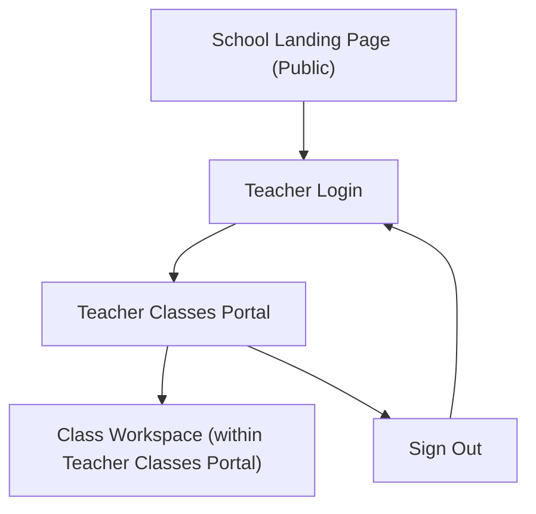

## 1. Product Overview
Per-school public landing pages plus teacher accounts, where each teacher can access and manage only the classes they are assigned within that school.
The goal is to provide a public-facing school page and a secure teacher portal with strict class-level access control.

## 2. Core Features

### 2.1 User Roles
| Role | Registration Method | Core Permissions |
|------|---------------------|------------------|
| Public Visitor | None | Can view public school landing pages. |
| Teacher (Authenticated) | Invited/provisioned account (email) and password reset, or self-signup restricted to an allowed school domain (optional configuration) | Can sign in, view only assigned classes in a given school, and manage only those assigned classes. |

### 2.2 Feature Module
Our requirements consist of the following main pages:
1. **School Landing Page (Public)**: school overview/branding, public contact/info, teacher sign-in entry.
2. **Teacher Login**: authenticate teacher and route them to their school context.
3. **Teacher Classes Portal**: list assigned classes, open a class workspace, enforce “only my assigned classes” access.

### 2.3 Page Details
| Page Name | Module Name | Feature description |
|-----------|-------------|---------------------|
| School Landing Page (Public) | School resolution | Resolve the school by URL slug and load its public profile (name, logo, description, key info). |
| School Landing Page (Public) | Public content | Display school branding and public information intended for visitors. |
| School Landing Page (Public) | Teacher entry | Link teachers to sign in (and optionally show “Continue as signed-in teacher” when already authenticated). |
| Teacher Login | Authentication | Sign in with email + password via hosted/embedded auth; handle errors and password reset flow. |
| Teacher Login | School context | Ensure the authenticated teacher is associated with a school; route into the teacher portal scoped to that school. |
| Teacher Classes Portal | Assigned classes list | Fetch and display only classes assigned to the signed-in teacher (scoped to their school). |
| Teacher Classes Portal | Class workspace access | Open a class workspace view for an assigned class; block/deny access attempts to unassigned classes. |
| Teacher Classes Portal | Class management (scoped) | Allow teacher actions that modify class data supported by the product, strictly limited to the teacher’s assigned classes. |
| Teacher Classes Portal | Session controls | Show current teacher identity + school context; provide sign out. |

## 3. Core Process
**Public Visitor Flow**
1. Visitor opens a school link (e.g., from search or a shared URL).
2. Visitor views the school’s public landing page.
3. If they are a teacher, they click “Teacher Sign In”.

**Teacher Flow**
1. Teacher navigates to a school landing page or directly to the teacher login.
2. Teacher signs in.
3. Teacher is redirected to the Teacher Classes Portal scoped to their school.
4. Teacher sees only assigned classes.
5. Teacher opens a class workspace and performs allowed class management actions.
6. Teacher signs out.

