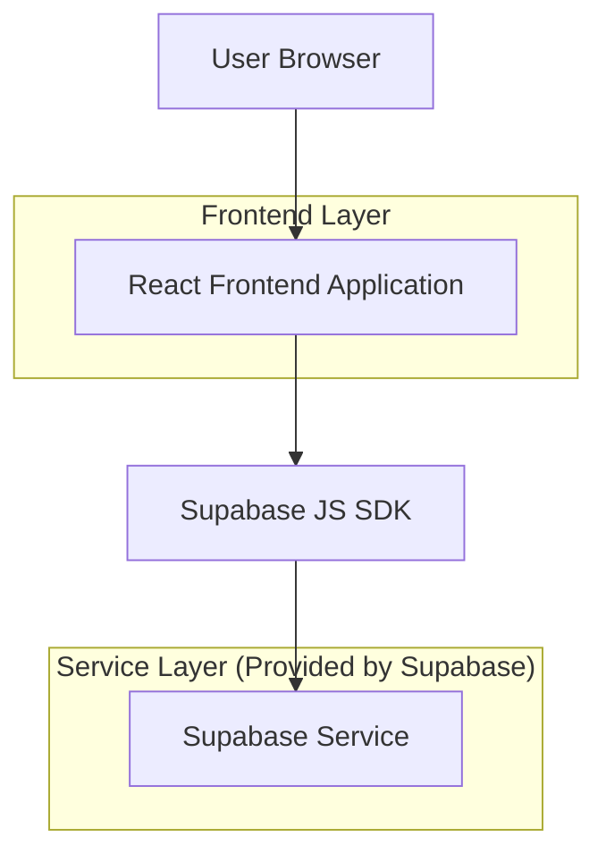

## 1.Architecture design


## 2.Technology Description
- Frontend: React@18 + TypeScript + vite + tailwindcss@3
- Backend: Supabase (Auth + PostgreSQL)

## 3.Route definitions
| Route | Purpose |
|-------|---------|
| /s/:schoolSlug | Public school landing page resolved by school slug |
| /teacher/login | Teacher authentication (sign in / reset password) |
| /teacher/classes | Teacher portal showing only assigned classes |
| /teacher/classes/:classId | Deep link to a specific class workspace (must be assigned) |

## 6.Data model(if applicable)

### 6.1 Data model definition
```mermaid
erDiagram
  SCHOOL ||--o{ CLASS : has
  SCHOOL ||--o{ TEACHER_PROFILE : contains
  TEACHER_PROFILE ||--o{ TEACHER_CLASS_ASSIGNMENT : assigned
  CLASS ||--o{ TEACHER_CLASS_ASSIGNMENT : includes

  SCHOOL {
    uuid id
    string slug
    string name
    string logo_url
    string public_description
    string public_contact
    timestamptz created_at
  }

  CLASS {
    uuid id
    uuid school_id
    string name
    string grade_level
    bool is_active
    timestamptz created_at
  }

  TEACHER_PROFILE {
    uuid id
    uuid user_id
    uuid school_id
    string display_name
    timestamptz created_at
  }

  TEACHER_CLASS_ASSIGNMENT {
    uuid id
    uuid teacher_profile_id
    uuid class_id
    string role
    timestamptz created_at
  }
```

### 6.2 Data Definition Language
Schools (schools)
```
CREATE TABLE schools (
  id UUID PRIMARY KEY DEFAULT gen_random_uuid(),
  slug TEXT UNIQUE NOT NULL,
  name TEXT NOT NULL,
  logo_url TEXT,
  public_description TEXT,
  public_contact TEXT,
  created_at TIMESTAMPTZ NOT NULL DEFAULT NOW()
);

CREATE INDEX idx_schools_slug ON schools(slug);
```

Classes (classes)
```
CREATE TABLE classes (
  id UUID PRIMARY KEY DEFAULT gen_random_uuid(),
  school_id UUID NOT NULL,
  name TEXT NOT NULL,
  grade_level TEXT,
  is_active BOOLEAN NOT NULL DEFAULT TRUE,
  created_at TIMESTAMPTZ NOT NULL DEFAULT NOW()
);

CREATE INDEX idx_classes_school_id ON classes(school_id);
CREATE INDEX idx_classes_active ON classes(is_active);
```

Teacher profiles (teacher_profiles)
```
CREATE TABLE teacher_profiles (
  id UUID PRIMARY KEY DEFAULT gen_random_uuid(),
  user_id UUID UNIQUE NOT NULL,
  school_id UUID NOT NULL,
  display_name TEXT,
  created_at TIMESTAMPTZ NOT NULL DEFAULT NOW()
);

CREATE INDEX idx_teacher_profiles_school_id ON teacher_profiles(school_id);
```

Teacher class assignments (teacher_class_assignments)
```
CREATE TABLE teacher_class_assignments (
  id UUID PRIMARY KEY DEFAULT gen_random_uuid(),
  teacher_profile_id UUID NOT NULL,
  class_id UUID NOT NULL,
  role TEXT NOT NULL DEFAULT 'teacher',
  created_at TIMESTAMPTZ NOT NULL DEFAULT NOW(),
  UNIQUE(teacher_profile_id, class_id)
);

CREATE INDEX idx_tca_teacher_profile_id ON teacher_class_assignments(teacher_profile_id);
CREATE INDEX idx_tca_class_id ON teacher_class_assignments(class_id);
```

Base grants (Supabase guideline)
```
-- Public visitors can read public school landing data
GRANT SELECT ON schools TO anon;
GRANT SELECT ON schools TO authenticated;

-- Teachers are authenticated; data access is still restricted by RLS policies
GRANT ALL PRIVILEGES ON classes TO authenticated;
GRANT ALL PRIVILEGES ON teacher_profiles TO authenticated;
GRANT ALL PRIVILEGES ON teacher_class_assignments TO authenticated;
```

Row Level Security (RLS) policies (recommended)
```
-- Enable RLS
ALTER TABLE schools ENABLE ROW LEVEL SECURITY;
ALTER TABLE classes ENABLE ROW LEVEL SECURITY;
ALTER TABLE teacher_profiles ENABLE ROW LEVEL SECURITY;
ALTER TABLE teacher_class_assignments ENABLE ROW LEVEL SECURITY;

-- Public can read schools
CREATE POLICY "Public can read schools"
ON schools FOR SELECT
TO anon
USING (true);

-- Teacher can read their own profile
CREATE POLICY "Teacher can read own profile"
ON teacher_profiles FOR SELECT
TO authenticated
USING (user_id = auth.uid());

-- Teacher can read only their assignments
CREATE POLICY "Teacher can read own assignments"
ON teacher_class_assignments FOR SELECT
TO authenticated
USING (
  teacher_profile_id IN (
    SELECT tp.id FROM teacher_profiles tp
    WHERE tp.user_id = auth.uid()
  )
);

-- Teacher can read only assigned classes (and within their school)
CREATE POLICY "Teacher can read assigned classes"
ON classes FOR SELECT
TO authenticated
USING (
  id IN (
    SELECT tca.class_id
    FROM teacher_class_assignments tca
    JOIN teacher_profiles tp ON tp.id = tca.teacher_profile_id
    WHERE tp.user_id = auth.uid()
  )
);

-- If teachers need to update class data, restrict to assigned classes
CREATE POLICY "Teacher can update assigned classes"
ON classes FOR UPDATE
TO authenticated
USING (
  id IN (
    SELECT tca.class_id
    FROM teacher_class_assignments tca
    JOIN teacher_profiles tp ON tp.id = tca.teacher_profile_id
    WHERE tp.user_id = auth.uid()
  )
)
WITH CHECK (
  id IN (
    SELECT tca.class_id
    FROM teacher_class_assignments tca
    JOIN teacher_profiles tp ON tp.id = tca.teacher_profile_id
    WHERE tp.user_id = auth.uid()
  )
);
```

Notes
- Teacher accounts and teacher→class assignments can be provisioned operationally (e.g., via Supabase dashboard/admin scripts) without requiring an admin UI in this MVP.
- If you later add an admin UI, keep it as a separate role and policy set.
